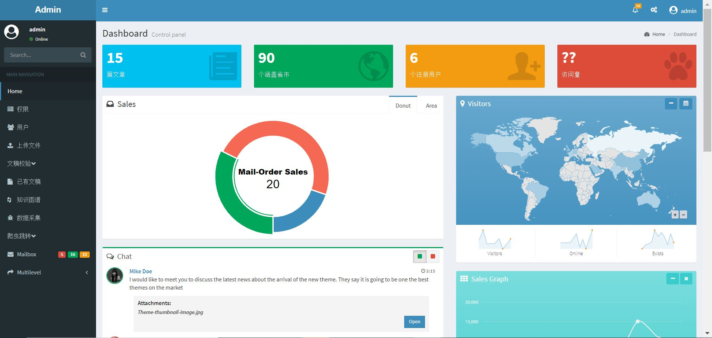
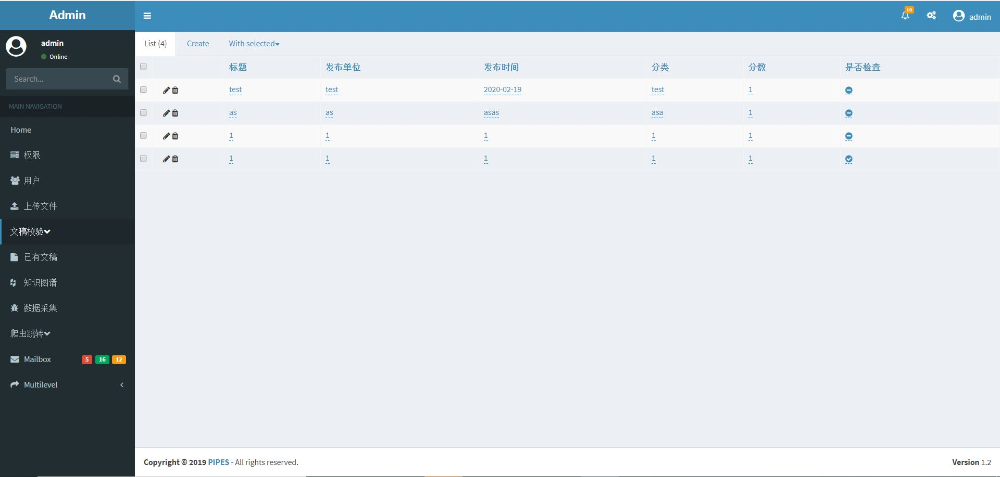
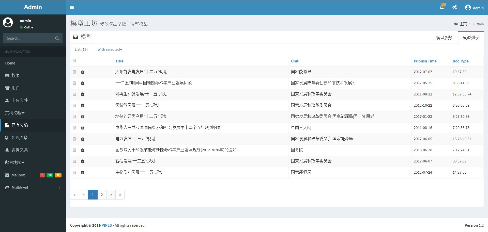
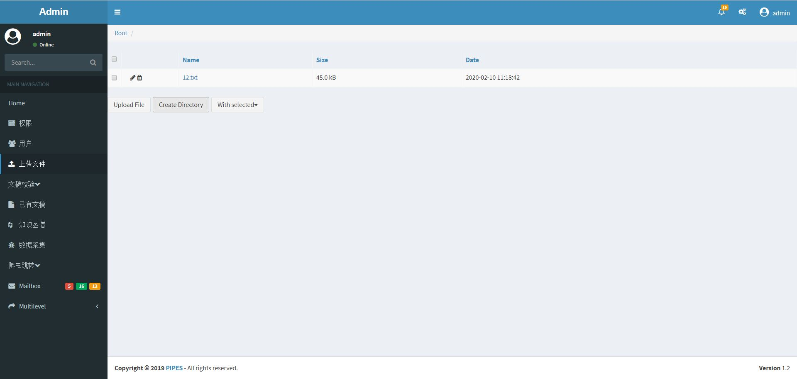

# README

# Flask-Admin Dashboard

基于Flask Admin构建的网站后台管理系统，功能包括：

- 用户注册
- 以游客，管理员，超级管理的登陆
- 权限管理
- 文件上传
- 数据库管理
- 界面皮肤自定义
- 数据图表等

Utilities:

- AdminLTE Bootstrap template
- Flask-Security
- Flask-Admin
- A lot of Charts libraries
- Postgres

### 使用手册

- Clone or download the git repository. `sh $ git clone https://github.com/openpipes/pipes.git`
- Create and activate a virtual environment: `sh $ virtualenv venv $ source venv/bin/activate`
- Install the requirements inside the app folder `sh $ pip install -r requirements.txt`
- Once the process finishes give execution permission to app.py file and run it `sh $ chmod +x app.py $ ./app.py`
- The first execution will create automatically a sample sqlite database.
- Open your favorite browser and type `localhost:5568/admin` then just log in with the default user or register one.

### 日志

2020.02.26 新功能： 

- 首页图表链接数据库，实现实时更新；
- 增加外部链接跳转功能（如跳转至谷歌）；
- 可自定义对数据库数据的批量操作功能；
- 数据库管理界面实现分页，富文本编辑；

### 界面截图

## 功能

首页

- 统计数据
    - 访问数量
    - 文件数量
- 交互图表 *To do
    - 政策发布的时间分布
    - 政策发布的类型分布
    - 交互的中国地图
- 留言区*To do （未建立数据库）
    - 用户给后台留言
- 模型工坊*To do
    - 模拟器
    - 变量列表
    - 模型列表
    - 运行日志
    - 变量列表
        - 复选变量
        - 批量提交变量至模拟器
    - 模型列表
        - 单选模型
        - 提交模型至模拟器
    - 模拟器
        - 删除变量
        - 修改参数
        - 运行模型
    - 运行日志
        - 显示提交过的模型
        - 下载模型的输出文件
        - 提供多种格式的输出
    - 通知栏
        - 显示系统通知
        - 显示模型运行状态的通知
- 知识图谱*To do
    - 嵌入neo4j的视图
    - 保存图谱的图片
    - 下载图谱中导出的数据(根据权限)